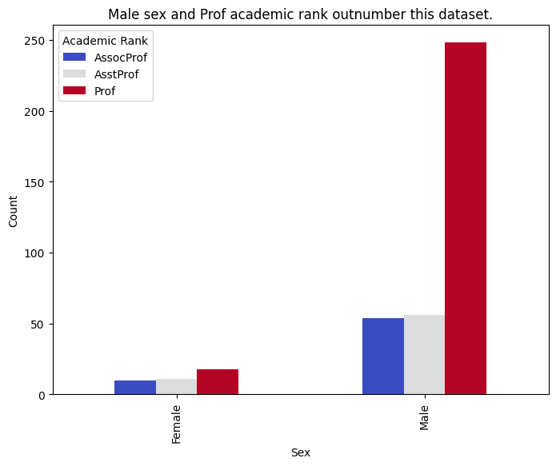
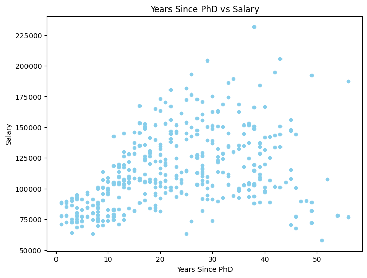
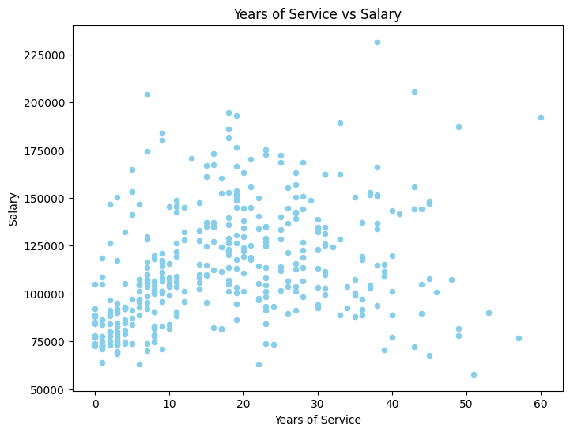

# Python for Data Analytics Course Educational Project with Dummy Data

## Salary data wrangling, cleaning, and analysis

This dataset was provided in class for us to clean, explore, and analyze. 

My tools include: 
- Python and corresponding libraries
- VS Code
- Jupyter Notebook extension 

dataset link: https://github.com/CunyLaguardiaDataAnalytics/datasets/blob/master/Salaries.csv

## Data Dictionary 
This dataset has 397 rows and 6 columns. 

| variable | description | data type    |
|:---------|:------------|:-----------  |
|rank      |academic rank |string       |
|discipline  |academic discipline |string |
|yrs.since.phd |years since phd |integer |
|yrs.service |years of service |integer |
|sex |person's sex |string |
|salary |annual salary |integer |

## Findings
- academic rank:
    - Prof:      266
    - AssProf:   67
    - AssocProf: 64
- sex:
    - male: 358
    - female: 39
- years since phd:
    - min: 1
    - max: 56
    - average: 22
- years of service: 
    - min: 0
    - max: 60
    - average: 18
- salary:
    - min: 57800
    - max: 231545
    - average: 113706

## Visualizations

## Insights
In this dummy dataset there's lots of data analytics tasks to perform and insights to draw. I only focused on the tasks above and the following insights:
1. Dataset Imbalance
- Sex imbalance:
    - This dataset is heavily skewed towards males, which may limit generalizability. 
- Academic rank imbalance:
    - The `Prof` rank significantly outnumbers `AssProf` and `AssocProf`, which may bias analysis and models.
2. Salary Relationships
- Weak to Moderate Correlation:
    - There is a weak to moderate correlation between `salary` and `yrs_since_phd` and `yrs_service`, which suggests other factors may play a significant role in determining salary. 
## Recommendations
